# FluentTextTable

「オブジェクトを手軽にコンソールに出力したい」そう思ったことはありませんか？

FluentTextTableを利用すると、全角にも対応したテキストテーブルを簡単に利用できます！

```cs
{
    new User {Id = 1, EnglishName = "Bill Gates", JapaneseName = "ビル・ゲイツ", Birthday = DateTime.Parse("1955/10/28")},
    new User {Id = 2, EnglishName = "Steven Jobs", JapaneseName = "スティーブ・ジョブズ", Birthday = DateTime.Parse("1955/2/24")}
};
Build
    .TextTable<User>()
    .WriteLine(users);
```

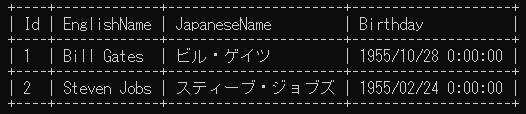

複雑なテーブルの書式を、簡単かつ流暢（Fluent）に変更できます。

```cs
Build
    .TextTable<User>(builder =>
    {
        builder
            .Borders.Horizontals.AllStylesAs("-")
            .Borders.HeaderHorizontal.AllStylesAs("=")
            .Columns.Add(x => x.Id).HorizontalAlignmentAs(HorizontalAlignment.Right)
            .Columns.Add(x => x.Name).VerticalAlignmentAs(VerticalAlignment.Center)
            .Columns.Add(x => x.Birthday).VerticalAlignmentAs(VerticalAlignment.Bottom).FormatAs("{0:yyyy/MM/dd}")
            .Columns.Add(x => x.Occupations).FormatAs("- {0}");
    })
    .WriteLine(users);
```

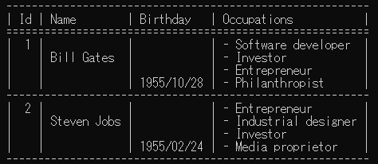

そしてマークダウンもサポートします。

```cs
Build
    .MarkdownTable<User>()
    .WriteLine(users);
```

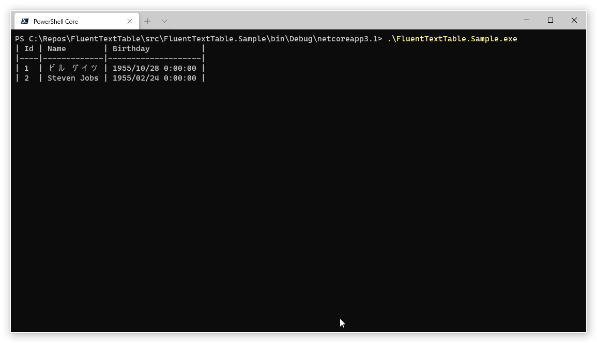

# 目次

- [Quick Start](#quick-start)
- [Markdown形式](#Markdown形式)
- [複数行セルのサポート](#複数行セルのサポート)
- 書式
  - [列書式](#列書式)
  - [罫線](#罫線)
  - [マージン](#マージン)
  - [パディング](#パディング)


# Quick Start

.NET Framework 4.0以上、.NET Standard 2.0以上をサポートしています。[NuGet](https://www.nuget.org/packages/FluentTextTable)からインストールして利用してください。

```console
> Install-Package FluentTextTable
```

出力対象となるクラスを定義します。

```cs
public class User
{
    public int Id { get; set; }
    public string EnglishName { get; set; }
    public string JapaneseName { get; set; }
    public DateTime Birthday;
}
```

Buildクラスを利用して出力対象クラス用のテーブルを作成します。

デフォルトではpublicなプロパティ・フィールドのすべてが出力の対象となります。

```cs
var table = Build.TextTable<User>();
```

行に該当するオブジェクトを生成して、出力します。

```cs
var users = new[]
{
    new User {Id = 1, EnglishName = "Bill Gates", JapaneseName = "ビル・ゲイツ", Birthday = DateTime.Parse("1955/10/28")},
    new User {Id = 2, EnglishName = "Steven Jobs", JapaneseName = "スティーブ・ジョブズ", Birthday = DateTime.Parse("1955/2/24")}
};
Build
    .TextTable<User>()
    .WriteLine(users);
```


# Markdown形式

FluentTextTableでは一般的なMarkdown形式で出力することもできます。

```cs
Build
    .MarkdownTable<User>()
    .WriteLine(users);
```


中央寄せ・右寄せも可能です。詳細は[列書式](#列書式)をご覧ください。

# 複数行セルのサポート

ひとつのセルの中での改行をサポートします。

つぎのいずれかの場合、改行して出力されます。

- 改行コードの含まれるstringプロパティ・フィールド
- 配列やListなどIEnumerable<object>で定義されたプロパティ・フィールド

```cs
private class User
{
    public int Id { get; set; }
    public string Name { get; set; }
    public DateTime Birthday;
    public string Parents { get; set; }
    public string[] Occupations { get; set; }
}

var users = new[]
{
    new User
    {
        Id = 1, 
        Name = "Bill Gates", 
        Birthday = DateTime.Parse("1955/10/28"),
        Parents = $"Bill Gates Sr.{Environment.NewLine}Mary Maxwell Gates",
        Occupations = new []{"Software developer", "Investor", "Entrepreneur", "Philanthropist"}
    }
};

var table = Build.TextTable<User>(builder =>
{
    builder
        .Columns.Add(x => x.Id).NameAs("ID").HorizontalAlignmentAs(HorizontalAlignment.Right)
        .Columns.Add(x => x.Name).VerticalAlignmentAs(VerticalAlignment.Center)
        .Columns.Add(x => x.Birthday).VerticalAlignmentAs(VerticalAlignment.Bottom).FormatAs("{0:yyyy/MM/dd}")
        .Columns.Add(x => x.Parents).VerticalAlignmentAs(VerticalAlignment.Center).FormatAs("- {0}")
        .Columns.Add(x => x.Occupations).HorizontalAlignmentAs(HorizontalAlignment.Center);
});
table.WriteLine(users);
```

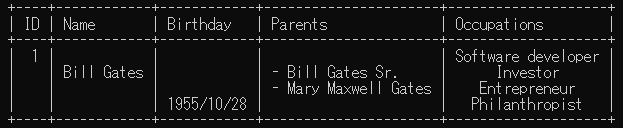

書式の詳細は[列書式](#列書式)をご覧ください。

マークダウンの場合、改行タグで出力されます。

```cs
var table = Build.MarkdownTable<User>(builder =>
{
    builder
        .Columns.Add(x => x.Id).NameAs("ID").HorizontalAlignmentAs(HorizontalAlignment.Right)
        .Columns.Add(x => x.Name).VerticalAlignmentAs(VerticalAlignment.Center)
        .Columns.Add(x => x.Birthday).VerticalAlignmentAs(VerticalAlignment.Bottom).FormatAs("{0:yyyy/MM/dd}")
        .Columns.Add(x => x.Parents).VerticalAlignmentAs(VerticalAlignment.Center).FormatAs("- {0}")
        .Columns.Add(x => x.Occupations).HorizontalAlignmentAs(HorizontalAlignment.Center);
});
table.WriteLine(users);
```

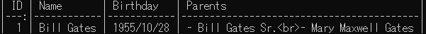

これを表示するとつぎのようになります。

| ID | Name       | Birthday   | Parents                                  | Occupations                                                      |
|---:|------------|------------|------------------------------------------|:----------------------------------------------------------------:|
|  1 | Bill Gates | 1955/10/28 | - Bill Gates Sr.<br>- Mary Maxwell Gates | Software developer<br>Investor<br>Entrepreneur<br>Philanthropist |

Markdownの場合、垂直方向のアライメントは有効になりません。


# 書式

## 列書式

デフォルトではすべてのpublicなプロパティとフィールドが出力されます。

```cs
static void Main()
{
    var users = new[]
    {
        new User {Id = 1, Name = "ビル ゲイツ", Birthday = DateTime.Parse("1955/10/28")},
        new User {Id = 2, Name = "Steven Jobs", Birthday = DateTime.Parse("1955/2/24")}
    };

    Build
        .TextTable<User>()
        .WriteLine(users);
}
```

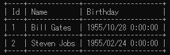

出力する列を指定することも可能です。

```cs
Build
    .TextTable<User>(builder =>
    {
        builder
            .Columns.Add(x => x.Name)
            .Columns.Add(x => x.Birthday);
    })
    .WriteLine(users);
```

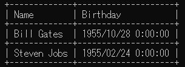

列には、つぎの書式を設定できます。

- 水平方向アライメント
- 垂直方向アライメント
- 列名
- フォーマット

```cs
var table = Build.TextTable<User>(builder =>
{
    builder
        .Columns.Add(x => x.Id).NameAs("ID").HorizontalAlignmentAs(HorizontalAlignment.Right)
        .Columns.Add(x => x.Name).VerticalAlignmentAs(VerticalAlignment.Center)
        .Columns.Add(x => x.Birthday).VerticalAlignmentAs(VerticalAlignment.Bottom).FormatAs("{0:yyyy/MM/dd}")
        .Columns.Add(x => x.Parents).VerticalAlignmentAs(VerticalAlignment.Center).FormatAs("- {0}")
        .Columns.Add(x => x.Occupations).HorizontalAlignmentAs(HorizontalAlignment.Center);
});
table.WriteLine(users);
```

複数行セルの場合、セル内の行単位でフォーマットされることに注意してください。

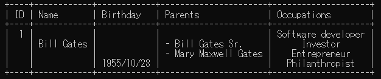


## 罫線

すべての罫線は任意のスタイルに変更できます（Markdown形式では未サポート）。

```cs
var table = Build.TextTable<User>(builder =>
{
    builder
        .Borders.Top
            .LeftStyleAs("-")
            .IntersectionStyleAs("-")
            .RightStyleAs("-")
        .Borders.HeaderHorizontal
            .LineStyleAs("=")
        .Borders.InsideHorizontal
            .AsDisable()
        .Borders.Bottom
            .LeftStyleAs("*")
            .IntersectionStyleAs("*")
            .RightStyleAs("*");
});
```

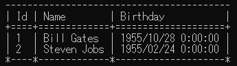

ボーダーは、まとめて設定することが可能です。

```cs
Build
    .TextTable<User>(builder =>
    {
        builder
            .Borders.Horizontals.AllStylesAs("-")
            .Borders.InsideHorizontal.AllStylesAs("=")
            .Borders.Verticals.LineStyleAs("$");
    })
    .WriteLine(users);
```

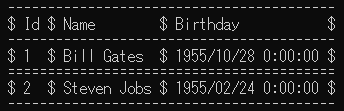

罫線には、つぎのような領域が定義されています。

- Top
- HeaderHorizontal
- InsideHorizontal
- Bottom
- Left
- InsideVertical
- Right

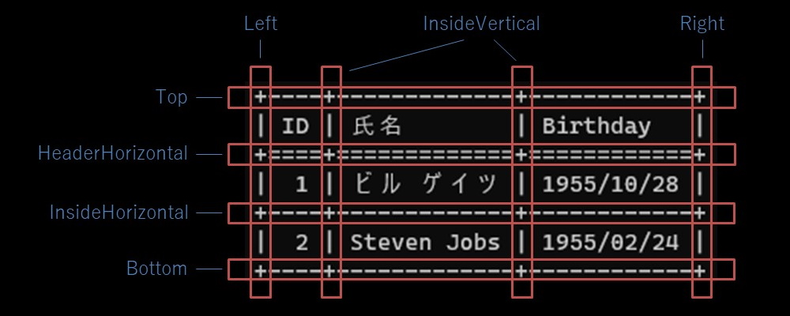

水平方向のボーダーは、つぎのスタイルが変更可能です。

- LeftStyle
- IntersectionStyle
- RightStyle
- LineStyle

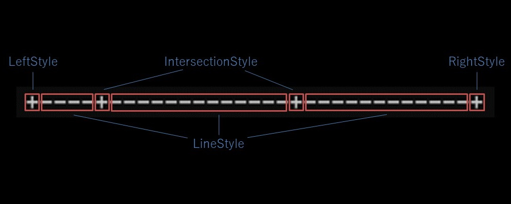

垂直方向のボーダーは、LineStyleのみ変更可能です。交点は水平方向のボーダーによって決定されます。


## マージン

テーブルの左右のマージンを指定できます。

```cs
Build
    .TextTable<User>(builder =>
    {
        builder
            .Margins.Left.As(4)
            .Margins.Right.As(2);
    })
    .WriteLine(users);
```

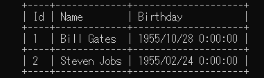

右側のマージンはコンソール出力では不要ですが、テキストファイルに出力する場合には有用なこともあるでしょう。

```cs
var text = Build
    .TextTable<User>(builder =>
    {
        builder
            .Margins.Left.As(4)
            .Margins.Right.As(2);
    })
    .ToString(users);
```

## パディング

セルの内側の左右のパディングを任意の幅に設定することが可能です。

```cs
Build
    .TextTable<User>(builder =>
    {
        builder
            .Paddings.Left.As(4)
            .Paddings.Right.As(2);
    })
    .WriteLine(users);
```

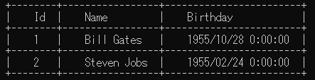