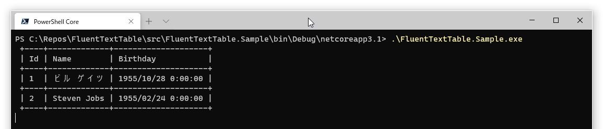
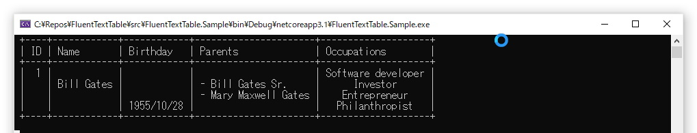
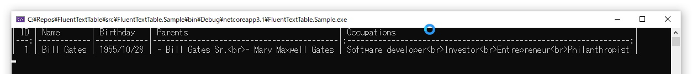
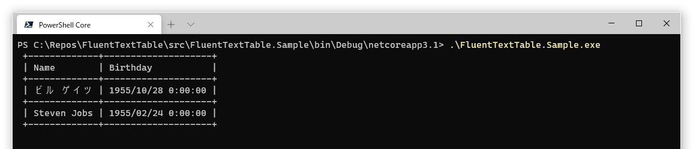
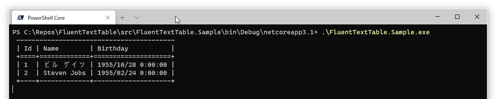

# FluentTextTable

Have you ever just wanted to output .NET object out to console?

FluentTextTable makes it easy to use a text table that also supports full-width characters!

```cs
static void Main()
{
    var users = new[]
    {
        new User {Id = 1, Name = "ビル ゲイツ", Birthday = DateTime.Parse("1955/10/28")},
        new User {Id = 2, Name = "Steven Jobs", Birthday = DateTime.Parse("1955/2/24")}
    };

    Build
        .TextTable<User>()
        .WriteLine(users);
}
```



You can change the format of the table easily and fluently.

Hides the borders between lines and specifies the format of the item values.

```cs
Build
    .TextTable<User>(builder =>
    {
        builder
            .Borders.InsideHorizontal.AsDisable()
            .Columns.Add(x => x.Id).HorizontalAlignmentAs(HorizontalAlignment.Right)
            .Columns.Add(x => x.Name).NameAs("氏名")
            .Columns.Add(x => x.Birthday).FormatAs("{0:yyyy/MM/dd}");
    })
    .WriteLine(users);
```


# Table of Contents

- [Quick Start](#quick-start)
- [Markdown format](#markdown-format)
- [Multi-line cell support](#multi-line-cell-support)
- Format
  - [Column format](#Column-format)
  - [Borders](#borders)


# Quick Start

NET Framework 4.0 and higher and .NET Standard 2.0 and higher are supported.Install and use it from [NuGet](https://www.nuget.org/packages/FluentTextTable).

```console
> Install-Package FluentTextTable
```

Define the class to be output.

```cs
private class User
{
    public int Id { get; set; }
    public string Name { get; set; }
    public DateTime Birthday;
}
```

Use the Build class to create a table for the output class.

By default, all public properties and fields are included in the output.

```cs
var table = Build.TextTable<User>();
```

Create and output an object corresponding to a row.

```cs
var users = new[]
{
    new User {Id = 1, Name = "ビル ゲイツ", Birthday = DateTime.Parse("1955/10/28")},
    new User {Id = 2, Name = "Steven Jobs", Birthday = DateTime.Parse("1955/2/24")}
};
table.WriteLine(users);
```


# Markdown format

FluentTextTable supports the popular Markdown format.

```cs
Build
    .MarkdownTable<User>()
    .WriteLine(users);
```


You can also align to the center or right. See [Column format](#Column-Format) for details.

# Multi-line cell support

Supports line breaks in a single cell.

A new line is output in one of the following cases

- The string properties and field containing the line feed code
- Properties and fields defined in IEnumerable<object>, such as Array and List

```cs
private class User
{
    public int Id { get; set; }
    public string Name { get; set; }
    public DateTime Birthday;
    public string Parents { get; set; }
    public string[] Occupations { get; set; }
}

var users = new[]
{
    new User
    {
        Id = 1, 
        Name = "Bill Gates", 
        Birthday = DateTime.Parse("1955/10/28"),
        Parents = $"Bill Gates Sr.{Environment.NewLine}Mary Maxwell Gates",
        Occupations = new []{"Software developer", "Investor", "Entrepreneur", "Philanthropist"}
    }
};

var table = Build.TextTable<User>(builder =>
{
    builder
        .Columns.Add(x => x.Id).NameAs("ID").HorizontalAlignmentAs(HorizontalAlignment.Right)
        .Columns.Add(x => x.Name).VerticalAlignmentAs(VerticalAlignment.Center)
        .Columns.Add(x => x.Birthday).VerticalAlignmentAs(VerticalAlignment.Bottom).FormatAs("{0:yyyy/MM/dd}")
        .Columns.Add(x => x.Parents).VerticalAlignmentAs(VerticalAlignment.Center).FormatAs("- {0}")
        .Columns.Add(x => x.Occupations).HorizontalAlignmentAs(HorizontalAlignment.Center);
});
table.WriteLine(users);
```



See [Column Format](#Column-Format) for details of the format.

In the case of markdown, it is output as a br tag.

```cs
var table = Build.MarkdownTable<User>(builder =>
{
    builder
        .Columns.Add(x => x.Id).NameAs("ID").HorizontalAlignmentAs(HorizontalAlignment.Right)
        .Columns.Add(x => x.Name).VerticalAlignmentAs(VerticalAlignment.Center)
        .Columns.Add(x => x.Birthday).VerticalAlignmentAs(VerticalAlignment.Bottom).FormatAs("{0:yyyy/MM/dd}")
        .Columns.Add(x => x.Parents).VerticalAlignmentAs(VerticalAlignment.Center).FormatAs("- {0}")
        .Columns.Add(x => x.Occupations).HorizontalAlignmentAs(HorizontalAlignment.Center);
});
table.WriteLine(users);
```



Here's how it would look like

| ID | Name       | Birthday   | Parents                                  | Occupations                                                      |
|---:|------------|------------|------------------------------------------|:----------------------------------------------------------------:|
|  1 | Bill Gates | 1955/10/28 | - Bill Gates Sr.<br>- Mary Maxwell Gates | Software developer<br>Investor<br>Entrepreneur<br>Philanthropist |

In Markdown, vertical alignment is not enabled.


# Format

## Column format

By default, all public properties and fields are included in the output.

```cs
static void Main()
{
    var users = new[]
    {
        new User {Id = 1, Name = "ビル ゲイツ", Birthday = DateTime.Parse("1955/10/28")},
        new User {Id = 2, Name = "Steven Jobs", Birthday = DateTime.Parse("1955/2/24")}
    };

    Build
        .TextTable<User>()
        .WriteLine(users);
}
```

You can also specify the columns to be output.

```cs
Build
    .TextTable<User>(builder =>
    {
        builder
            .Columns.Add(x => x.Name)
            .Columns.Add(x => x.Birthday);
    })
    .WriteLine(users);
```



The columns can be formatted as follows

The columns can be formatted as follows

- Horizontal Alignment
- Vertical Alignment
- Header name
- Format

```cs
var table = Build.TextTable<User>(builder =>
{
    builder
        .Columns.Add(x => x.Id).NameAs("ID").HorizontalAlignmentAs(HorizontalAlignment.Right)
        .Columns.Add(x => x.Name).VerticalAlignmentAs(VerticalAlignment.Center)
        .Columns.Add(x => x.Birthday).VerticalAlignmentAs(VerticalAlignment.Bottom).FormatAs("{0:yyyy/MM/dd}")
        .Columns.Add(x => x.Parents).VerticalAlignmentAs(VerticalAlignment.Center).FormatAs("- {0}")
        .Columns.Add(x => x.Occupations).HorizontalAlignmentAs(HorizontalAlignment.Center);
});
table.WriteLine(users);
```


## Borders

All borders can be changed to any style (Markdown format is not supported).

```cs
var table = Build.TextTable<User>(builder =>
{
    builder
        .Borders.Top
            .LeftStyleAs("-")
            .IntersectionStyleAs("-")
            .RightStyleAs("-")
        .Borders.HeaderHorizontal
            .LineStyleAs("=")
        .Borders.InsideHorizontal
            .AsDisable()
        .Borders.Bottom
            .LeftStyleAs("*")
            .IntersectionStyleAs("*")
            .RightStyleAs("*");
});
```



The following areas are defined for the borders

- Top
- HeaderHorizontal
- InsideHorizontal
- Bottom
- Left
- InsideVertical
- Right


The horizontal border can be changed in the following styles

- LeftStyle
- IntersectionStyle
- RightStyle
- LineStyle


The vertical border can only be changed by LineStyle. Intersections are determined by the horizontal border.


